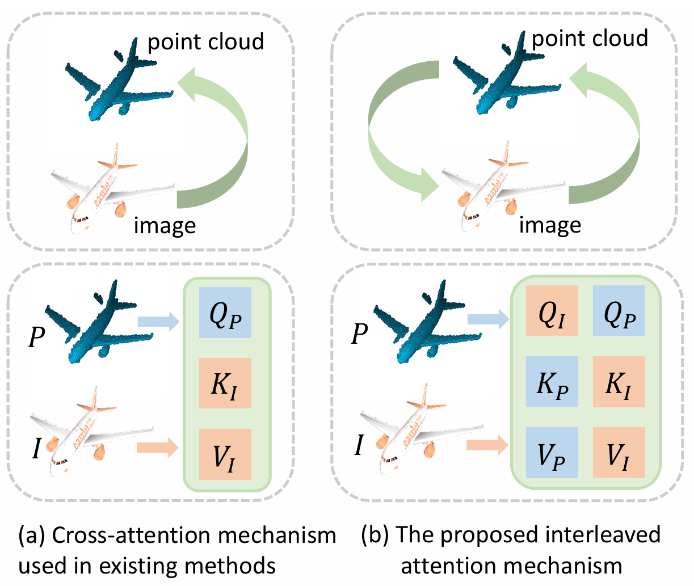

<div align="center">

# [Multi-Modal Point Cloud Completion with Interleaved <br> Attention Enhanced Transformer](https://doi.org/10.24963/ijcai.2025/108)

<a href="https://pytorch.org/get-started/locally/"></a>
[](https://2025.ijcai.org/)

</div>

<p align="center">
  
</p>

## 📚 Abstract
Multi-modal point cloud completion, which utilizes a complete image and a partial point cloud as input, is a crucial task in 3D computer vision. Previous methods commonly employ a cross-attention mechanism to fuse point clouds and images. However, these approaches often fail to fully leverage image information and overlook the intrinsic geometric details of point clouds that could complement the image modality. To address these challenges, we propose an interleaved attention enhanced Transformer (IAET) with three main components, i.e., token embedding, bidirectional token supplement, and coarse-to-fine decoding. IAET incorporates a novel interleaved attention mechanism to enable bidirectional information supplementation between the point cloud and image modalities. Additionally, to maximize the use of the supplemented image information, we introduce a view-guided upsampling module that leverages image tokens as queries to guide the generation of detailed point cloud structures. Extensive experiments demonstrate the effectiveness of IAET, highlighting its state-of-the-art performance on multi-modal point cloud completion benchmarks in various scenarios.

## 🌱 Datasets
Use the code in  ``dataloader.py`` to load the dataset. 

### ShapeNet-ViPC
First, please download the [ShapeNetViPC-Dataset](https://pan.baidu.com/s/1NJKPiOsfRsDfYDU_5MH28A) (143GB, code: **ar8l**). Then run ``cat ShapeNetViPC-Dataset.tar.gz* | tar zx``, you will get ``ShapeNetViPC-Dataset`` contains three folders: ``ShapeNetViPC-Partial``, ``ShapeNetViPC-GT``, and ``ShapeNetViPC-View``. 

For each object, the dataset includes partial point clouds (``ShapeNetViPC-Patial``), complete point clouds (``ShapeNetViPC-GT``), and corresponding images (``ShapeNetViPC-View``) from 24 different views.

### KITTI
The KITTI dataset used in this work is sourced from the [Cross-PCC](https://github.com/ltwu6/cross-pcc).

Notably, You need to replace the current paths in the following files with the absolute path to your dataset: ``config_3depn.py:8``, ``config_vipc.py:12``, and ``eval_vipc.py:21``.

## 🚀 Getting Started
### Requirements
- Ubuntu: 18.04 and above
- CUDA: 11.3 and above
- PyTorch: 1.10.1 and above

### Using CUDA extension
activate your environment and then
```
cd cuda/ChamferDistance
python setup.py install
```
and
```
cd cuda/pointnet2_ops_lib
python setup.py install
```

### Training
The file ``config_vipc.py`` and ``config_3depn.py`` contain the configuration for all the training parameters.

Our code supports multi-GPU parallel training. Training on ViPC dataset with single GPU:
```
CUDA_VISIBLE_DEVICES=0 python train_vipc.py
```
Training on ViPC dataset with multiple GPUs (e.g., 4):
```
CUDA_VISIBLE_DEVICES=0, 1, 2, 3 python train_vipc.py 
```
Training on 3DEPN dataset with single GPU:
```
CUDA_VISIBLE_DEVICES=0 python train_3depn.py 
```

### Evaluation
To evaluate the models (select the specific category in ``config_vipc.py``):

```eval
CUDA_VISIBLE_DEVICES=0 python eval_vipc.py 
```

### Pre-trained weights
- [ShapeNet-ViPC](https://drive.google.com/drive/folders/1_0qIEw5huCMcc5ZsKSCMM98BQT8tJhC8?usp=sharing)

- [KITTI](https://drive.google.com/drive/folders/1uPCrkp-UDTiY7k1Xu2Ix1A-lGUmh3yfG?usp=sharing)

## ❤️ Acknowledgements
Some of the code of this repo is borrowed from:

- [XMFNet](https://github.com/diegovalsesia/XMFnet)

- [Cross-PCC](https://github.com/ltwu6/cross-pcc)

- [SnowflakeNet](https://github.com/AllenXiangX/SnowflakeNet)

- [ChamferDistance](https://github.com/ThibaultGROUEIX/ChamferDistancePytorch)

- [PointNet++](https://github.com/erikwijmans/Pointnet2_PyTorch)

## 📄 Cite this work

```bibtex
@inproceedings{fang2025iaet,
  title={Multi-Modal Point Cloud Completion with Interleaved Attention Enhanced Transformer},
  author={Chenghao Fang and Jianqing Liang and Jiye Liang and Hangkun Wang and Kaixuan Yao and Feilong Cao},
  booktitle={Proceedings of the Thirty-Fourth International Joint Conference on Artificial Intelligence (IJCAI)},
  pages={963-971},
  year={2025}
}
```

## 📌 License

This project is open sourced under MIT license.
